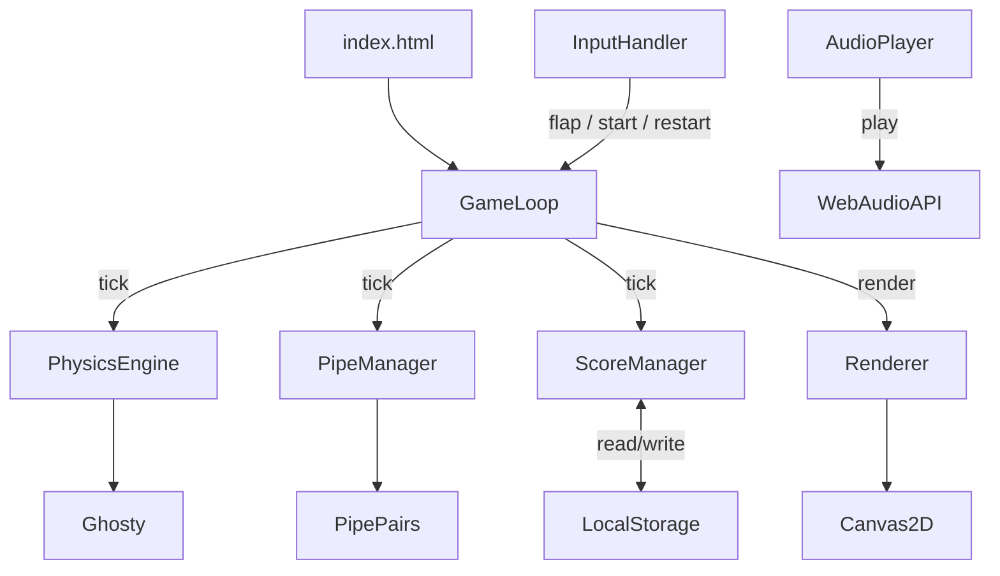

# Design Document: Flappy Kiro

## Overview

Flappy Kiro is a browser-based retro endless scroller game implemented as a single HTML file using pure HTML5 Canvas and vanilla JavaScript. The player controls Ghosty, a ghost character sprite, navigating through an infinite series of pipe obstacles. The game loop runs at 60 fps via `requestAnimationFrame`, applying gravity each frame and responding to keyboard/pointer input to apply upward flap impulses.

The implementation is self-contained: one `.html` file embeds all game logic, styling, and asset references. Assets (`ghosty.png`, `jump.wav`, `game_over.wav`) are loaded from the `assets/` directory relative to the HTML file.

### Key Design Decisions

- **Single file**: All JS lives in a `<script>` tag inside `index.html`. No build step, no bundler.
- **Component model via plain objects/classes**: Each logical subsystem (Physics, Pipes, Score, Audio, Renderer, Input) is a distinct module/class to keep concerns separated without framework overhead.
- **Canvas scaling**: The canvas is sized to `window.innerWidth × window.innerHeight` and re-scaled on `resize` events. Game constants (pipe speed, gap size, spawn interval) are expressed as fractions of canvas dimensions so the game remains playable at any size.
- **State machine**: The game has three states — `START`, `PLAYING`, `GAME_OVER` — managed by a single `gameState` variable. All subsystems branch on this state.

---

## Architecture



The `GameLoop` is the central coordinator. Each frame it:
1. Updates physics (Ghosty position/velocity)
2. Updates pipes (scroll, spawn, despawn)
3. Checks collisions
4. Updates score
5. Renders everything

`InputHandler` listens for `keydown` (Space) and `pointerdown` events and calls back into the game loop to trigger flaps or state transitions.

---

## Components and Interfaces

### GameLoop

Manages `requestAnimationFrame`, holds `gameState`, and orchestrates all subsystems each tick.

```js
// Pseudo-interface
GameLoop {
  state: 'START' | 'PLAYING' | 'GAME_OVER'
  start(): void          // called once on page load
  tick(timestamp): void  // rAF callback
  handleInput(): void    // called by InputHandler
  reset(): void          // resets all subsystems for a new run
}
```

### Ghosty (Physics Engine)

Holds Ghosty's position and velocity; applies gravity and flap impulses.

```js
Ghosty {
  x: number          // fixed horizontal position (~25% of canvas width)
  y: number          // vertical position (canvas-relative)
  vy: number         // vertical velocity (px/frame)
  width: number      // sprite width
  height: number     // sprite height
  update(): void     // apply gravity, update y
  flap(): void       // set vy = -FLAP_STRENGTH
  reset(): void      // return to starting y, vy = 0
  rotation: number   // derived from vy for sprite rotation
}
```

Constants:
- `GRAVITY = 0.5` (px/frame²)
- `FLAP_STRENGTH = 9` (px/frame, upward)

### PipeManager

Spawns, scrolls, and despawns `PipePair` objects.

```js
PipeManager {
  pipes: PipePair[]
  update(): void     // scroll all pipes, despawn off-screen, spawn new if interval elapsed
  reset(): void      // clear all pipes, reset spawn timer
}

PipePair {
  x: number          // left edge of pipe
  gapY: number       // vertical center of gap
  scored: boolean    // whether this pair has been counted
  width: number      // pipe width (fixed)
  gapHeight: number  // fixed gap height
  topRect: Rect      // bounding box of top pipe
  bottomRect: Rect   // bounding box of bottom pipe
}
```

Constants:
- `PIPE_SPEED = 3` (px/frame, scales with canvas width)
- `PIPE_INTERVAL = 90` (frames between spawns)
- `GAP_HEIGHT = 0.28 * canvasHeight`
- `PIPE_WIDTH = 60` (px)
- Gap center randomized in `[GAP_HEIGHT/2 + margin, canvasHeight - SCORE_BAR_HEIGHT - GAP_HEIGHT/2 - margin]`

### ScoreManager

Tracks current score and high score; persists to `localStorage`.

```js
ScoreManager {
  score: number
  highScore: number
  init(): void          // load highScore from localStorage
  increment(): void     // score++
  checkHighScore(): void // update highScore if score > highScore, persist
  reset(): void         // score = 0
  LOCAL_STORAGE_KEY: 'flappyKiroHighScore'
}
```

### AudioPlayer

Wraps `HTMLAudioElement` for sound effects.

```js
AudioPlayer {
  playJump(): void
  playGameOver(): void
}
```

Audio elements are created once and their `currentTime` is reset before each play to allow rapid re-triggering.

### Renderer

Draws all game elements to the canvas each frame.

```js
Renderer {
  canvas: HTMLCanvasElement
  ctx: CanvasRenderingContext2D
  clouds: Cloud[]        // static decorative cloud positions
  drawBackground(): void
  drawClouds(): void
  drawPipes(pipes: PipePair[]): void
  drawGhosty(ghosty: Ghosty): void
  drawScoreBar(score, highScore): void
  drawStartScreen(): void
  drawGameOverScreen(score): void
  resize(): void         // recalculate canvas size and reposition clouds
}
```

### InputHandler

Attaches event listeners and delegates to the game loop.

```js
InputHandler {
  attach(onInput: () => void): void
  // listens for: keydown (Space), pointerdown (canvas)
}
```

---

## Data Models

### GameState

```
type GameState = 'START' | 'PLAYING' | 'GAME_OVER'
```

### Ghosty State

```
{
  x: number,
  y: number,
  vy: number,
  width: number,   // e.g. 40px
  height: number,  // e.g. 40px
}
```

### PipePair

```
{
  x: number,
  gapY: number,
  gapHeight: number,
  width: number,
  scored: boolean
}
```

Derived bounding boxes:
- Top pipe: `{ x, y: 0, w: width, h: gapY - gapHeight/2 }`
- Bottom pipe: `{ x, y: gapY + gapHeight/2, w: width, h: canvasHeight - (gapY + gapHeight/2) }`

### Cloud

```
{
  x: number,
  y: number,
  width: number,
  height: number,
  rx: number   // border-radius for rounded rect
}
```

Clouds are generated once at init and on resize; they do not move.

### Score Bar

Rendered at the bottom of the canvas:
- Height: `40px`
- Text format: `"Score: N | High: N"`

---

## Correctness Properties

*A property is a characteristic or behavior that should hold true across all valid executions of a system — essentially, a formal statement about what the system should do. Properties serve as the bridge between human-readable specifications and machine-verifiable correctness guarantees.*

### Property 1: Flap sets upward velocity

*For any* Ghosty state with any current vertical velocity, applying a flap impulse SHALL result in Ghosty's vertical velocity being set to a fixed negative (upward) value, regardless of prior velocity.

**Validates: Requirements 2.2**

### Property 2: Gravity accumulates downward velocity

*For any* Ghosty state, after N frames without a flap, Ghosty's vertical velocity SHALL equal the initial velocity plus N × GRAVITY (downward), and Ghosty's y position SHALL increase monotonically.

**Validates: Requirements 2.1, 2.3**

### Property 3: Pipe gap center is always within safe bounds

*For any* newly spawned PipePair, the gap center SHALL be positioned such that both the top pipe and the bottom pipe are fully visible on the canvas (i.e., gap center is at least `GAP_HEIGHT/2 + margin` from the top and at least `GAP_HEIGHT/2 + margin + SCORE_BAR_HEIGHT` from the bottom).

**Validates: Requirements 3.2, 3.3**

### Property 4: Score increments exactly once per pipe

*For any* PipePair that Ghosty passes through, the Score SHALL increment by exactly 1, and subsequent passes of the same PipePair SHALL NOT increment the Score again.

**Validates: Requirements 5.1, 5.2**

### Property 5: High score is non-decreasing across runs

*For any* sequence of runs, the stored High_Score SHALL never decrease — it SHALL be the maximum Score observed across all runs.

**Validates: Requirements 4.4, 6.1, 6.2**

### Property 6: High score round-trip through localStorage

*For any* High_Score value written to localStorage, reading it back SHALL produce the same integer value.

**Validates: Requirements 6.2, 6.3**

### Property 7: Collision detection is symmetric with bounding boxes

*For any* Ghosty position and PipePair position, a collision SHALL be detected if and only if Ghosty's axis-aligned bounding box overlaps the top pipe rectangle or the bottom pipe rectangle.

**Validates: Requirements 4.1, 4.2**

---

## Error Handling

| Scenario | Handling |
|---|---|
| `ghosty.png` fails to load | Draw a fallback colored rectangle in place of the sprite |
| `jump.wav` / `game_over.wav` fail to load | Silently skip audio playback; game continues |
| `localStorage` unavailable (private browsing, quota exceeded) | Catch the exception; high score lives in memory only for the session |
| Canvas not supported | Show a `<noscript>`-style message in the page body |
| Window resize during gameplay | Recalculate canvas size; reposition Ghosty proportionally; regenerate clouds |

---

## Testing Strategy

### Unit Tests

Focus on pure logic functions that have no DOM/Canvas dependency:

- **Physics**: `applyGravity(ghosty)` and `applyFlap(ghosty)` — verify velocity and position updates
- **Collision**: `checkCollision(ghosty, pipes, canvasHeight, scoreBarHeight)` — verify AABB overlap logic
- **Score**: `ScoreManager.increment()`, `checkHighScore()`, localStorage read/write
- **Pipe bounds**: `randomGapCenter(canvasHeight, gapHeight, scoreBarHeight, margin)` — verify output is always within safe range
- **Score bar format**: `formatScoreText(score, highScore)` — verify output string format

### Property-Based Tests

Using [fast-check](https://github.com/dubzzz/fast-check) (JavaScript PBT library). Each property test runs a minimum of 100 iterations.

**Property 1 — Flap sets upward velocity**
Generate arbitrary `vy` values; call `applyFlap`; assert `ghosty.vy === -FLAP_STRENGTH`.
`// Feature: flappy-kiro, Property 1: Flap sets upward velocity`

**Property 2 — Gravity accumulates downward velocity**
Generate arbitrary initial `vy` and frame count N; apply gravity N times; assert `vy` equals `initialVy + N * GRAVITY` and y increases.
`// Feature: flappy-kiro, Property 2: Gravity accumulates downward velocity`

**Property 3 — Pipe gap center is always within safe bounds**
Generate arbitrary canvas heights and score bar heights; call `randomGapCenter`; assert result is within `[GAP_HEIGHT/2 + margin, canvasHeight - scoreBarHeight - GAP_HEIGHT/2 - margin]`.
`// Feature: flappy-kiro, Property 3: Pipe gap center is always within safe bounds`

**Property 4 — Score increments exactly once per pipe**
Generate a sequence of Ghosty x-positions crossing a pipe; call the scoring check multiple times; assert score increments by exactly 1 total.
`// Feature: flappy-kiro, Property 4: Score increments exactly once per pipe`

**Property 5 — High score is non-decreasing**
Generate a sequence of run scores; apply `checkHighScore` after each; assert the stored high score equals the running maximum.
`// Feature: flappy-kiro, Property 5: High score is non-decreasing across runs`

**Property 6 — High score localStorage round-trip**
Generate arbitrary non-negative integers; write to localStorage via `ScoreManager`; read back; assert equality.
`// Feature: flappy-kiro, Property 6: High score round-trip through localStorage`

**Property 7 — Collision detection matches AABB overlap**
Generate arbitrary Ghosty positions and PipePair positions; compute expected AABB overlap independently; assert `checkCollision` result matches.
`// Feature: flappy-kiro, Property 7: Collision detection is symmetric with bounding boxes`

### Integration / Smoke Tests

- Load `index.html` in a headless browser (Playwright); verify canvas element is present and game renders without JS errors.
- Verify that pressing Space transitions from `START` → `PLAYING` state.
- Verify that a simulated collision transitions to `GAME_OVER` state and plays `game_over.wav`.
